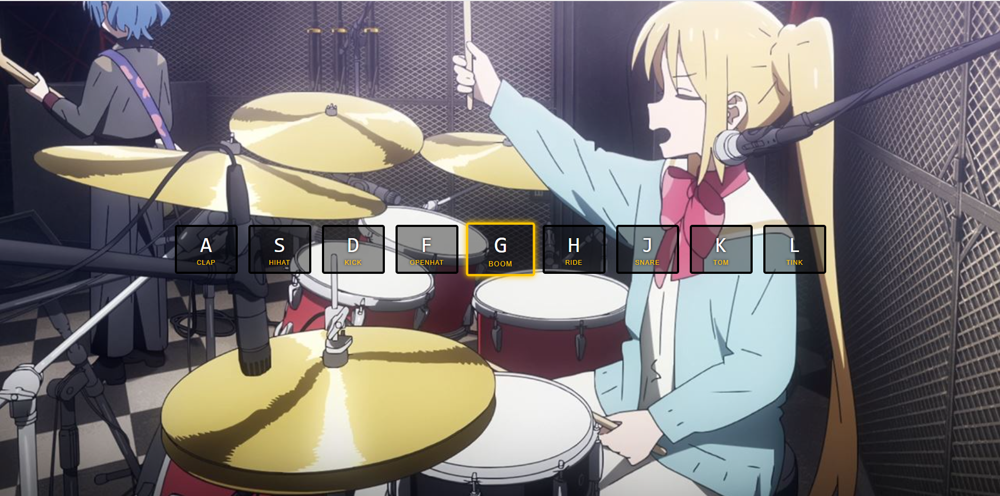

# Day 1 of JavaScript 30
Today I learned more about event listeners, specifically keyboard events. In addition to this I learned about audio tag in HTML and Keyboard codes. I utilized this new knowledge to add onto pre-existing html and css code by creating a script.js to handle the keyboard presses to simulate animation in creating a drum kit.

### Here is a preview of what the webpage looks like while the G key is pressed:
