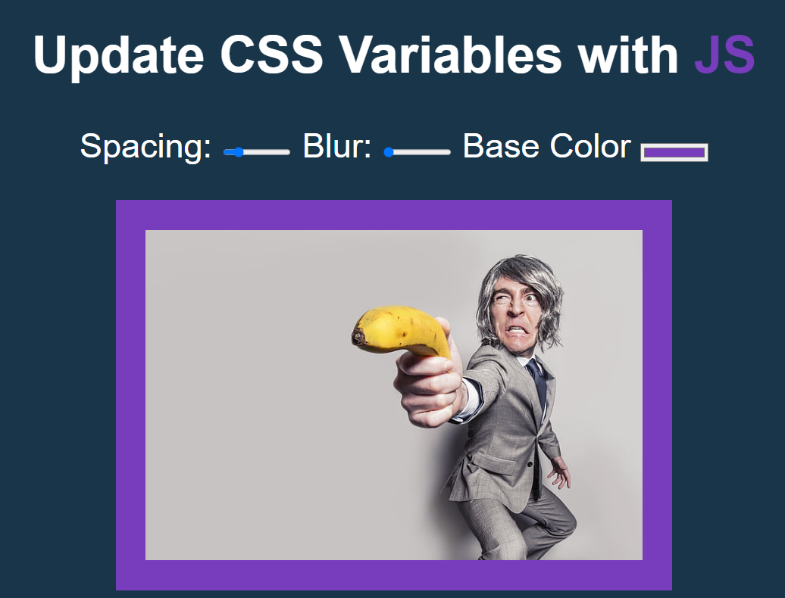

# Day 3 of JavaScript30

I learned to use variables in CSS and specifically target elements to change those variables.  
I also learned a bit about datasets stored within elements and how to get those values from within a JS file.

