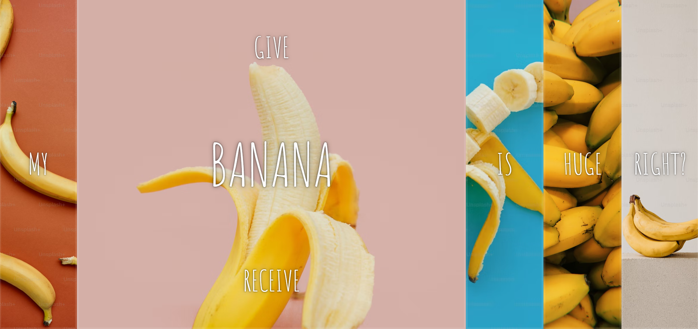

# Day 5 of JavaScript30

Today I practiced a bit of my flexbox skills.  
In addition to this I was able to learn new ways to target even more specific elements using CSS.  
For instance:  
``` .panel > *:first-child ``` selects the first child element of an element with the .panel class.

Preview:
<div align="center">
    
</div>